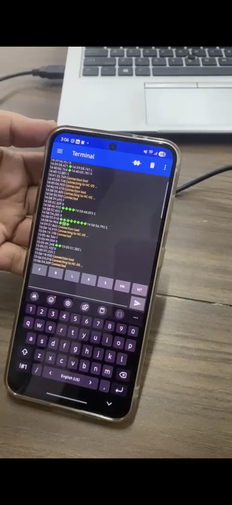

<h1 align="center">Gesture-Controlled Robot</h1>

<p align="center">
  A wireless robotic system controlled using smartphone gestures and Bluetooth communication.
</p>

<p align="center">
  <b>Arduino</b> • <b>HC-05 Bluetooth</b> • <b>Accelerometer</b> • <b>Motor Driver</b>
</p>

---
## About The Project

The **Gesture-Controlled Robot** is a wireless mobile robot that can be controlled using the movement and orientation of a smartphone.

The smartphone's built-in **accelerometer** detects the direction in which the phone is tilted. These gestures are converted into movement commands and transmitted wirelessly to the robot using an **HC-05 Bluetooth module**.

The Arduino receives the commands, processes them, and controls the DC motors through a motor driver.

This project demonstrates the practical integration of **embedded systems, Bluetooth communication, mobile sensors, motor control, and robotics**.

---

## Features

- Smartphone-based gesture control
- Wireless communication using HC-05 Bluetooth
- Real-time robot movement
- Forward movement
- Backward movement
- Left movement
- Right movement
- Stop command
- Arduino-based control
- Simple and low-cost design
- Beginner-friendly robotics project

---

## How It Works

The system follows a simple communication and control process:

```text
              +----------------------+
              |      Smartphone      |
              |  Accelerometer + App |
              +----------+-----------+
                         |
                         | Bluetooth
                         v
              +----------------------+
              |    HC-05 Module      |
              +----------+-----------+
                         |
                         | Serial Data
                         v
              +----------------------+
              |     Arduino UNO      |
              |    / Arduino Nano    |
              +----------+-----------+
                         |
                         | Control Signals
                         v
              +----------------------+
              |    Motor Driver      |
              |     L293D / L298N    |
              +----------+-----------+
                         |
                    +----+----+
                    |         |
                    v         v
               +--------+ +--------+
               | Motor 1| | Motor 2|
               +--------+ +--------+
                    |         |
                    +----+----+
                         |
                         v
                  Robot Movement
````

---

## Gesture Commands

The smartphone application converts the detected gestures into simple character commands.

| Gesture / Command  | Character | Robot Action  |
| ------------------ | :-------: | ------------- |
| Tilt Forward       |    `F`    | Move Forward  |
| Tilt Backward      |    `B`    | Move Backward |
| Tilt Left          |    `L`    | Turn Left     |
| Tilt Right         |    `R`    | Turn Right    |
| No Movement / Stop |    `S`    | Stop          |

---

## Working Principle

The robot works through the following steps:

### 1. Detect Smartphone Movement

The smartphone's built-in accelerometer detects changes in its orientation.

### 2. Convert Gesture into Command

The Bluetooth controller application converts the detected gesture into a command such as:

```text
F → Forward
B → Backward
L → Left
R → Right
S → Stop
```

### 3. Transmit the Command

The command is transmitted wirelessly from the smartphone to the **HC-05 Bluetooth module**.

### 4. Process the Command

The HC-05 sends the received data to the Arduino through serial communication.

### 5. Control the Motors

The Arduino processes the received command and sends appropriate control signals to the motor driver.

### 6. Move the Robot

The motor driver controls the two DC geared motors, causing the robot to move in the required direction.

---

## Components Used

| Component                   |   Quantity  |
| --------------------------- | :---------: |
| Arduino UNO / Nano          |      1      |
| HC-05 Bluetooth Module      |      1      |
| L293D / L298N Motor Driver  |      1      |
| DC Geared Motors            |      2      |
| Robot Chassis               |      1      |
| 7.4V Lithium-ion Battery    |      1      |
| Breadboard                  |      1      |
| Voltage Divider (1kΩ + 2kΩ) |    1 Set    |
| Connecting Wires            | As Required |
| Caster Wheel                |      1      |
| Smartphone                  |      1      |

---

## System Architecture

### Signal Flow

```text
Smartphone
    |
    | Accelerometer
    v
Gesture Control Application
    |
    | Bluetooth
    v
HC-05 Bluetooth Module
    |
    | Serial Communication
    v
Arduino UNO / Nano
    |
    | Motor Control Signals
    v
L293D / L298N Motor Driver
    |
    +----------+----------+
    |                     |
    v                     v
 DC Motor 1           DC Motor 2
    |                     |
    +----------+----------+
               |
               v
        Robot Movement
```

---

## Circuit Diagram

The circuit diagram shows the electrical connections between the Arduino, HC-05 Bluetooth module, motor driver, motors, and power supply.

<p align="center">
  
</p>

[View Circuit Diagram](Circuit%20Diagram/Circuit%20Diagram.png)

---

## Block Diagram

The block diagram represents the overall communication and control flow of the robot.

<p align="center">
  
</p>

[View Block Diagram](Block%20Diagram/Block%20Diagram.png)

---

## Robot Movements

The repository contains images showing the different movements of the robot.

### Forward Movement


### Movement 2


### Movement 3


---

## Command Reference

The following commands are used by the Arduino program to control the robot:

```text
F → Forward
B → Backward
L → Left
R → Right
S → Stop
```

These commands provide a simple communication interface between the smartphone application and the robot.

---

## Software Requirements

The following software is required to build and program the robot:

* Arduino IDE
* Bluetooth Controller Application with Accelerometer Mode
* USB Driver for Arduino
* Appropriate Arduino board support package

---

## Programming

The robot is programmed using the **Arduino IDE**.

### Programming Language

```text
C / C++ (Arduino)
```

### Source Code

The complete Arduino program is available in the `Code` folder.

[Open GestureRobo.ino](Code/GestureRobo.ino)

---

## Installation and Setup

### Step 1 — Install Arduino IDE

Download and install the Arduino IDE on your computer.

### Step 2 — Open the Code

Open the following file:

```text
Code/GestureRobo.ino
```

### Step 3 — Select the Arduino Board

Select the appropriate board from:

```text
Tools → Board
```

Choose either:

```text
Arduino UNO
```

or

```text
Arduino Nano
```

depending on the controller used in your robot.

### Step 4 — Connect the Arduino

Connect the Arduino board to your computer using a USB cable.

### Step 5 — Upload the Program

Select the correct COM port and upload the program to the Arduino.

### Step 6 — Power the Robot

Connect the battery and power the robot circuit.

### Step 7 — Pair the HC-05

Pair the smartphone with the HC-05 Bluetooth module.

Common default pairing passwords are:

```text
1234
```

or

```text
0000
```

### Step 8 — Open the Bluetooth Application

Open a Bluetooth controller application that supports accelerometer or gesture-based control.

Connect the application to the HC-05 module.

### Step 9 — Control the Robot

Tilt the smartphone in different directions to control the robot.

```text
Tilt Forward  → Robot moves Forward
Tilt Backward → Robot moves Backward
Tilt Left     → Robot turns Left
Tilt Right    → Robot turns Right
Stop          → Robot stops
```

---

## Repository Structure

The project files are organized as follows:

```text
Gesture-Controlled-Robot/
│
├── Assets/
│   ├── Commands.jpg
│   ├── Image
│   ├── Movement 1.jpg
│   ├── Movement 2.jpg
│   └── Movement 3.jpg
│
├── Block Diagram/
│   └── Block Diagram.png
│
├── Circuit Diagram/
│   └── Circuit Diagram.png
│
├── Code/
│   └── GestureRobo.ino
│
├── Documentation/
│   └── REPORT.pdf
│
└── README.md
```

---

## Project Assets

The `Assets` folder contains images related to the project, including command references and robot movement images.

### Command Reference



---

## Documentation

Complete documentation of the project is available in the `Documentation` folder.

[View Project Report](Documentation/REPORT.pdf)

The report contains detailed information about the project, including its design, working principle, implementation, and results.

---

## Applications

The Gesture-Controlled Robot can be used for:

* Educational robotics
* Embedded systems demonstrations
* Wireless control experiments
* Human-machine interaction
* Robotics workshops
* Engineering exhibitions
* College project demonstrations
* Bluetooth communication experiments
* Mobile-controlled robotics

---

## Learning Outcomes

This project provides practical experience with:

* Arduino programming
* Embedded systems
* Bluetooth communication
* Serial communication
* Smartphone accelerometers
* Motor driver interfacing
* DC motor control
* Wireless robotic systems
* Human-machine interaction
* Hardware and software integration

---

## Future Enhancements

The project can be further improved by adding:

* Obstacle avoidance using ultrasonic sensors
* ESP32-CAM based camera integration
* IoT-based remote control
* GPS-based navigation
* Autonomous navigation
* Voice-controlled operation
* Real-time video streaming
* Mobile application with a custom interface
* Line-following capability
* Multiple control modes
* Battery monitoring system

---

## Conclusion

The **Gesture-Controlled Robot** demonstrates a simple and intuitive method of controlling a mobile robot using smartphone gestures.

By combining a smartphone accelerometer, Bluetooth communication, Arduino, motor driver, and DC motors, the project creates a practical wireless robotic control system.

The project provides a strong introduction to **embedded systems, wireless communication, robotics, and human-machine interaction**.

---

## Author

**Shriya Pande**

Robotics & Automation Intern — **CODEC Technologies**

This project was developed as part of my internship experience at CODEC Technologies, with a focus on practical implementation of robotics, embedded systems, Bluetooth communication, and wireless control.

---

## Acknowledgement

This project was developed as a hands-on robotics project to understand the practical implementation of wireless communication, smartphone-based control, Arduino programming, and motor control.

---

## License

This project is created for **educational and learning purposes**.

You are welcome to explore, modify, and build upon this project for educational purposes.

---

<p align="center">
  <b>Built with Arduino, Bluetooth and robotics.</b>
</p>

<p align="center">
  If you found this project useful or interesting, consider giving the repository a star.
</p>
